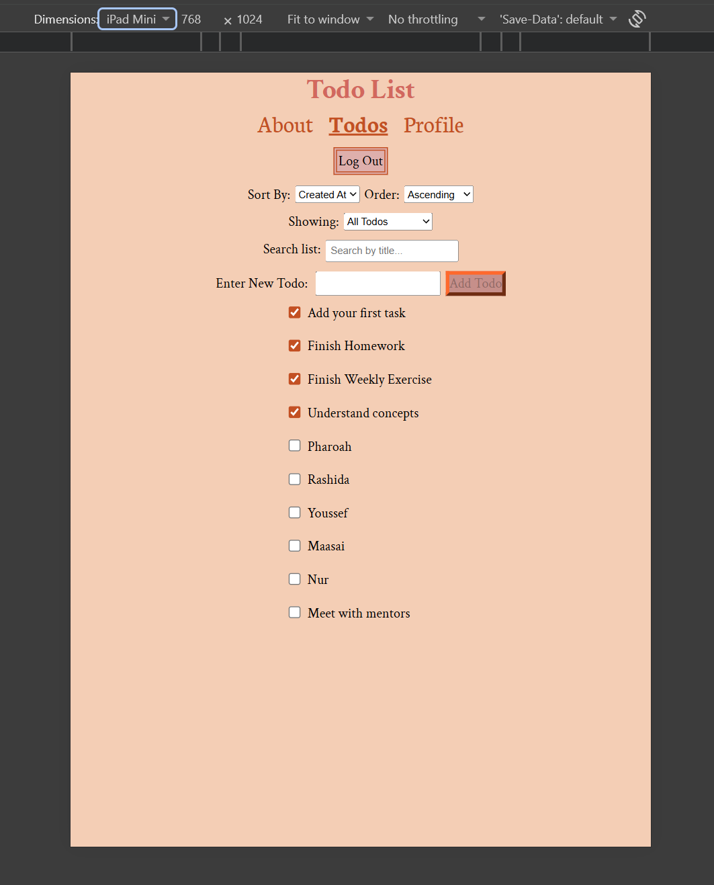
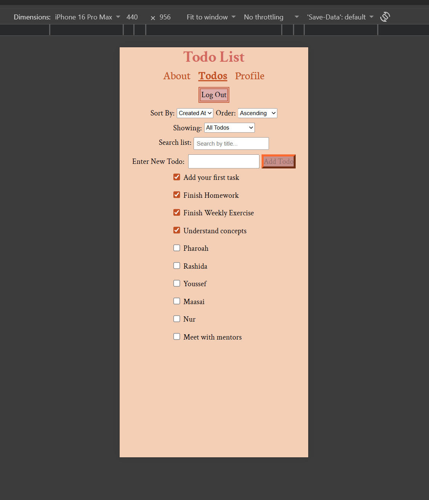

# Project Title: **To-Do List**. A To-do List application allowing users to manage a task list.

## Description: 
### Users can navigate through the app using the navigation buttons underneath the app title. The To-dos and Profile page require the user to be logged in to be accessed. 
### Via the To-dos page, tasks can be added and marked/unmarked as complete. Clicking on a task allows users to update the tasks' text or remove the task from the list.
### Also via the To-dos page, the todo list can be sorted alphabetically, by creation time, or completion status. 
### The About page contains a description on how the app works.
### The Profile page informs users on their authentication status, and shows their todo statistics; the number of tasks complete, incomplete, and the completion ratio.

## Live Demo Link: 
### https://ctd-to-do-list-2026.vercel.app/

## Features List: 
- Sign In.
- Logout.
- Add tasks.
- Update tasks.
- Delete tasks.
- Mark tasks complete / unmark complete.
- Filter tasks via user input and task completion status.
- Sort to-dos by creation date, alphabetically, ascending, or descending.
- Navigation to About Page, Profile Page, and To-dos Page. 
- Show user authentication status.
- Show user task completion percentage.

## Technologies Used: 
### Vite, React, React-DOM, React-Router, JavaScript, JSX, & CSS.

## Screenshots:
### Desktop Example

### iPad Example

### iPhone Example

## Getting Started (Project Prerequisites): 
### Before running this project, install the following: 
- Install React version 19.2.1 using the following command in the terminal: `npm install react@19.2.7`
- Install React-DOM, version 19.2.7, using the following command in the terminal: `npm install react-dom@19.2.7`
- Install React-Router version 7.19.3 using the following command in the terminal: `npm install react-router@7.19.3`
### Alternatively (using Vite framework)
- Scaffold a Vite project using its React template, which automatically includes the react-dom version included in the template: `npx create-vite@latest --template react .` 
- Run `npm run install` in the terminal to install all dependencies listed in the package.json file provided by template.
- Install React-Router version 7.19.3 using the following command in the terminal: `npm install react-router@7.19.3`.

## Available Scripts:
### `npm run dev`: Starts the application in a local development environment.
### `npm run build`: Prepares the project for deployment by bundling and translating  files into standard HTML, CSS, and JavaScript.
### `npm run lint`: Searches all project files for errors, bugs, and other inconsistencies.
### `npm run preview`: Starts a local web server to test how the application will behave when deployed. 

##  Design Decisions: 
### I chose the CSS module approach for styling to avoid potential naming conflicts as I styled my many components.  
### As tasks cannot be longer than 50 characters, I chose to make the app content centered for desktop users to draw attention to the center of the screen. 
### I emphasized the border around elements that can be tab focused to better supports users with cognitive or visual impairments. 
### For the background color I chose "F4CEB5", a shade of pink that is easy on the eyes as it will be the main color on the page at all times.
### For the primary color I chose "d2685e", a warm shade of red that I found complimented the background. It is only used for the application title. 
### For the secondary color I chose "c68f8a", a muted pink with a clear but not overwhelming difference from the primary color. It is used for the navigation links and the border around interactable elements when they are tab-focused. 
### For the accent color I chose "c35023", a dark red, used as the border around buttons and the border color for focused and hovered elements that are interactive.
### For the font I primarily used 'Crimson-Text' as it was non-standard but still easily readable. For the dropdown menus I switched to 'Neuton' for clear visual contrast in purpose. Sans-serif is in place as a backup font for browsers that lack either of the chosen fonts. 

## Future Improvements:
### Some things I would improve about the app in the future: 
1. A Dark mode feature.
2. A Sign up feature.
3. Add a Retry button for when errors occur.
4. Add a feature to the Profile page that tracks how often quickly users complete their tasks on time and displays that data.
5. Add a feature that allows users to set a date/time that tasks should be completed by. In addition, notify users when that limit nears. 

## License Information: 
### This project is licensed under the MIT License - see the License.txt file for details.

## Contact Information: https://github.com/PharoahEgbuna