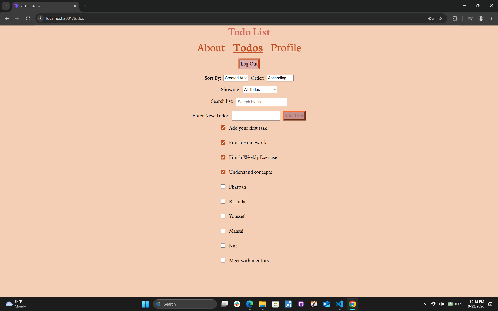
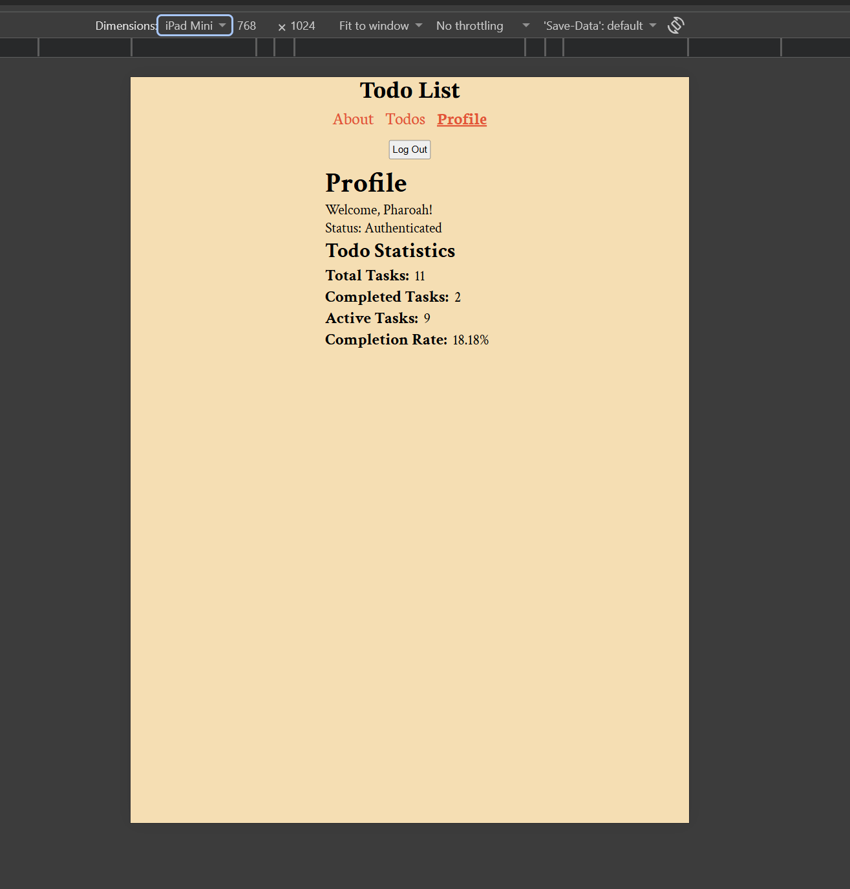
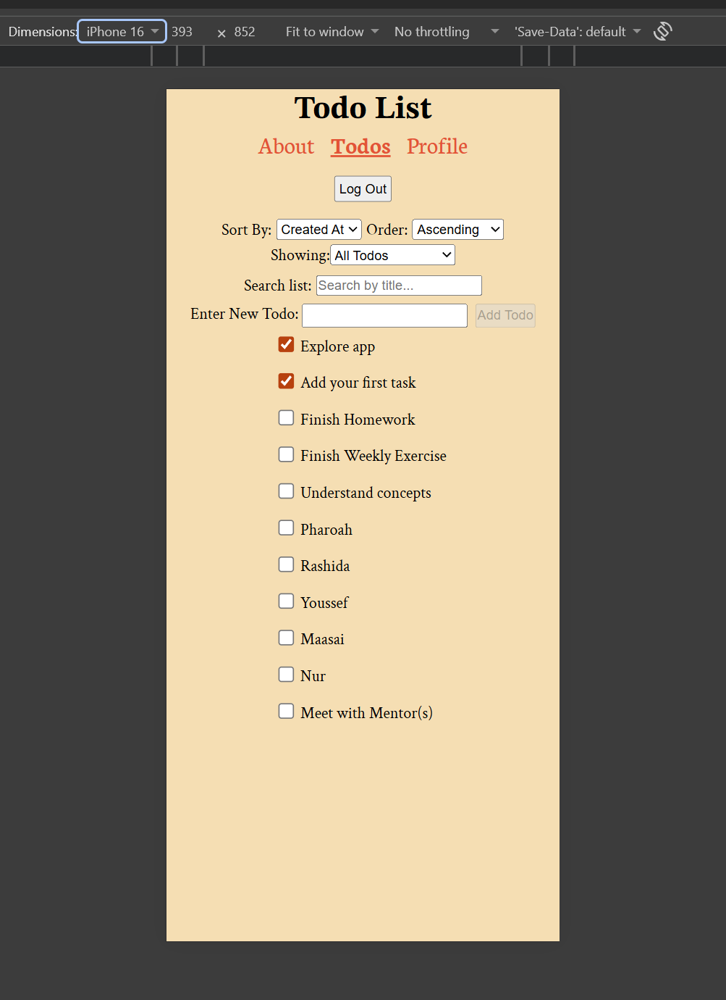

# App Title: **To-Do List**

## Description: A simple To-do List App for task management. 

## Features: 
1. Sign In
2. Logout
3. Add Todos
4. Update Todos
5. Delete Todos
6. Mark Complete
7. Mark Incomplete
8. Filter todos via user input or task completion status
9. Sort todos by creation date, alphabetically, ascending, or descending.
11. Navigate to About Page
12. Navigate to Profile page
13. Show user authentication status
14. Show user task completion rate

## Technologies Used: 
### Vite, React, React-DOM, React-Router, JavaScript, JSX, CSS.

## Screenshots:
### Desktop Example

### iPad Example

### iPhone Example

## Getting Started: 
### The editor used for this project was Visual Studio Code. 
### Begin by scaffolding a Vite project with a React template by running the following command in the terminal: `npx create-vite@latest --template react .`
### Install dependencies by running the command  `npm install`.
### Next, use the command  `npm install react-router` to install version 7 of React Router. 
### Lastly, run the development server by entering the following command in the terminal: `npm run dev`. Hold control whiel clicking the localhost link provided in the terminal to interact with the application. 

## Scripts Explained:
### `npm run dev`: The command used to start the local development server of the JavaScript application.
### `npm run build`: Prepares your project for deployment by bundling and translating your files into standard HTML, CSS< and Javascript, easily used by browsers.
### `npm run lint`: Searches for typos and bugs across your files
### `npm run preview`: Starts a local web server for the last step of product testing before deployment. 

##  Design Decisions: 
###  I chose a basic color palettle that that would compliment the black text color the app has has since the first week. 
###  I centered all app content to keep the user's gaze at the center of the screen rather than the left side. 

## Future Improvement: 
### With more time I would deploy my app and find a way to make only the selected todo shift when editing rather than the entire list. 

## License: 
### This project is licensed under the MIT License - see the Lincense.txt file for details.

## Contact Information: https://github.com/PharoahEgbuna